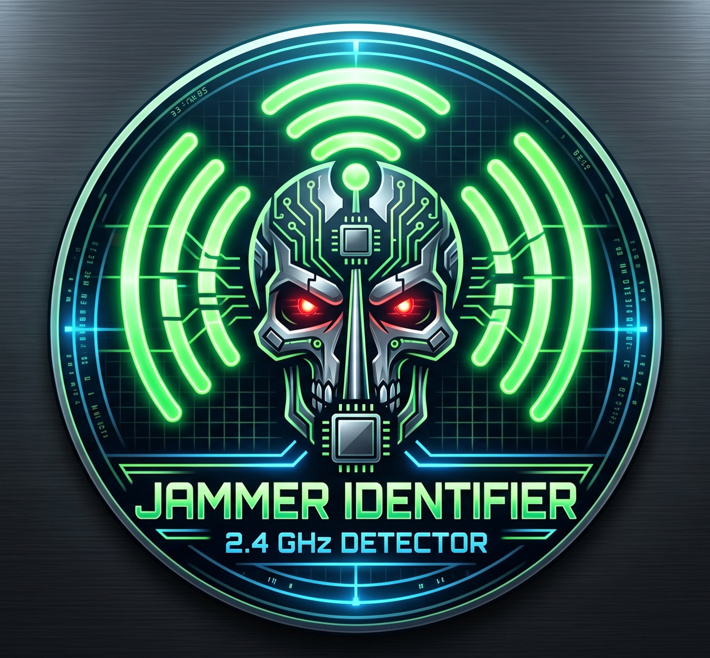
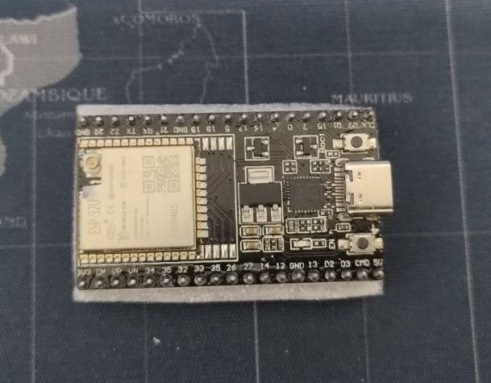
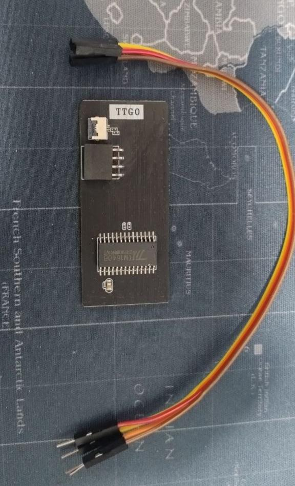
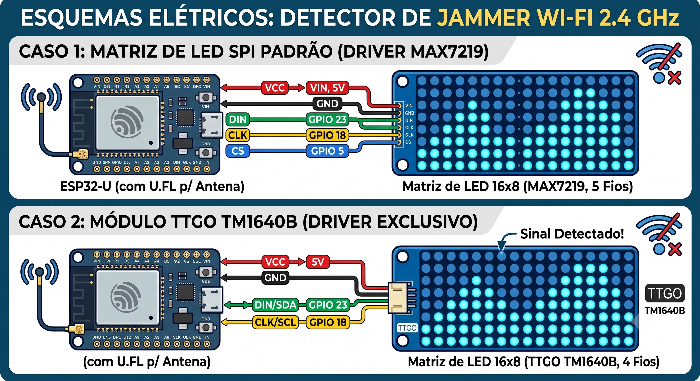

<!--  -->

# Jammer-Identifier

# Detector de Jammer Wi-Fi (Analisador de Espectro)
## ESP32-U + Matriz de LED 16x8

Este documento contém a documentação completa, o esquema elétrico detalhado e o código-fonte (firmware) para a construção de um identificador visual de jammers e interferências na rede Wi-Fi de 2.4 GHz utilizando o ESP32-U.

---

## 1. Visão Geral do Projeto e Limitações Técnicas

O **ESP32-U** possui um rádio integrado que opera exclusivamente na frequência de **2.4 GHz** (padrões Wi-Fi 802.11 b/g/n e Bluetooth). 
* **O que ele detecta:** Bloqueadores de sinal (jammers) de Wi-Fi, ataques de desautenticação (*Deauth flooding*), *Beacon spamming* ou ruído massivo intencional nesta faixa de frequência.
* **O que ele NÃO detecta:** Jammers de sinal de celular (GSM, 3G, 4G, 5G) ou bloqueadores de GPS, pois estes operam em frequências completamente diferentes.
* **Nota Crítica sobre o ESP32-U:** Como este modelo utiliza um conector **U.FL**, é **obrigatório** o uso de uma antena externa de 2.4 GHz acoplada ao conector. Sem a antena, o chip não terá sensibilidade para capturar os pacotes do ar.

O funcionamento baseia-se em colocar o rádio do ESP32 em **Modo Promíscuo (Sniffer)**. O firmware varre continuamente os 14 canais do Wi-Fi. Cada coluna da matriz de LED representa um canal e a altura da barra representa a intensidade de pacotes trafegados, operando como um "VU Meter".

---

## 2. Qual a área de cobertura (Alcance) do Detector?

Como o ESP32-U não possui antena embutida na placa, **a área de cobertura depende 100% da antena externa que você conectar a ele.**

1. **Antena Omnidirecional Padrão (2 dBi a 5 dBi):**
   * **Alcance Interno:** Aproximadamente **30 a 50 metros** de raio.
   * **Alcance Externo:** Pode chegar a **80 a 100 metros**.

2. **Antena Direcional (Painel ou Yagi de alto ganho):**
   * **Alcance:** Centenas de metros em linha de visada direta (focada em uma direção).

**Observação:** Como jammers emitem ruído em altíssima potência, seu detector frequentemente conseguirá detectá-los de distâncias muito maiores do que ouviria um roteador normal.

---

## 3. Componentes Necessários

1. **Placa de Desenvolvimento ESP32-U** (com conector U.FL)
2. **Antena Externa 2.4 GHz** com cabo pigtail U.FL
3. **Matriz de LED 16x8** (Pode ser padrão MAX7219 ou TTGO TM1640B)
4. **Protoboard e Jumpers**
5. **Cabo Micro-USB** para alimentação e transferência de código

---

## 4. Esquema Elétrico (Para Matriz Padrão MAX7219)

*(Se a sua matriz usa o chip **TM1640B / TTGO**, pule direto para a **Seção 8** no final deste documento).*

| Pino na Matriz (MAX7219) | Pino no ESP32-U | Função |
| :--- | :--- | :--- |
| **VCC** | **VIN** (ou 5V) | Alimentação positiva principal |
| **GND** | **GND** | Terra / Negativo comum |
| **DIN** | **GPIO 23** | Envio de dados serial |
| **CS** | **GPIO 5** | Seleção do dispositivo |
| **CLK** | **GPIO 18** | Sinal de clock |

---

## 5. Configuração da IDE do Arduino e Bibliotecas

### Passo 1: Instalar o Suporte ao ESP32
1. Vá em **Arquivo** > **Preferências**.
2. Em **URLs Adicionais para o Gerenciador de Placas**, adicione:
   `https://raw.githubusercontent.com/espressif/arduino-esp32/gh-pages/package_esp32_index.json`
3. Vá em **Ferramentas** > **Placa** > **Gerenciador de Placas**, busque por `esp32` e instale.

### Passo 2: Instalar a Biblioteca de Controle do LED
* Para matrizes MAX7219: Instale a biblioteca **LedControl** (por Eberhard Fahle).
* Para matrizes TM1640 (TTGO): Instale a biblioteca **TM16xx LEDs and Buttons** (por maxint-rd).

---

## 6. Código-Fonte (Para Matriz MAX7219)
O arquivo `esp-module-max7219.ino` contém o código-fonte completo para o ESP32-U operando com uma matriz de LED baseada no chip MAX7219. Ele inclui a configuração do modo promíscuo, a varredura dos canais Wi-Fi e a atualização da matriz de LED em tempo real.
*(Se a sua matriz for a TTGO TM1640B, use o código da Seção 8).*
---

## 7. Testes e Calibração

* **Ajuste de Sensibilidade:** Se as barras estiverem subindo muito facilmente devido ao uso normal da rede da sua casa, altere a linha `int height = map(count, 0, 80, 0, 8);` e mude o valor limite de `80` para `150` ou `200`.

---

## 8. APÊNDICE: Módulo TTGO / Wemos com Chip TM1640B

Como identificado pelo hardware, as matrizes **TTGO 16x8** usam o chip **TM1640B**. Este chip exige menos fios (não usa pino CS) e requer uma biblioteca diferente na IDE do Arduino.

### 8.1. Esquema Elétrico para TM1640B

Observe as letras pequenas na placa da sua matriz perto do conector branco de 4 pinos para confirmar a ordem, mas geralmente a ligação será assim:

| Pino na Matriz (Cabo JST 4 vias) | Pino no ESP32-U | Função |
| :--- | :--- | :--- |
| **VCC / 5V** | **VIN** (ou 5V) | Alimentação |
| **GND** | **GND** | Terra |
| **DIN / SDA** | **GPIO 23** | Envio de dados |
| **CLK / SCL** | **GPIO 18** | Sinal de clock |

### 8.2. Biblioteca Necessária
Na IDE do Arduino, vá em **Gerenciador de Bibliotecas**, busque por **TM16xx LEDs and Buttons** (criada por *maxint-rd*) e clique em Instalar.

### 8.3. Código-Fonte (Firmware) para TM1640B

O arquivo esp-module-tm1640B.ino é o código reescrito exclusivamente para funcionar com a  placa de LED TM1640B:
